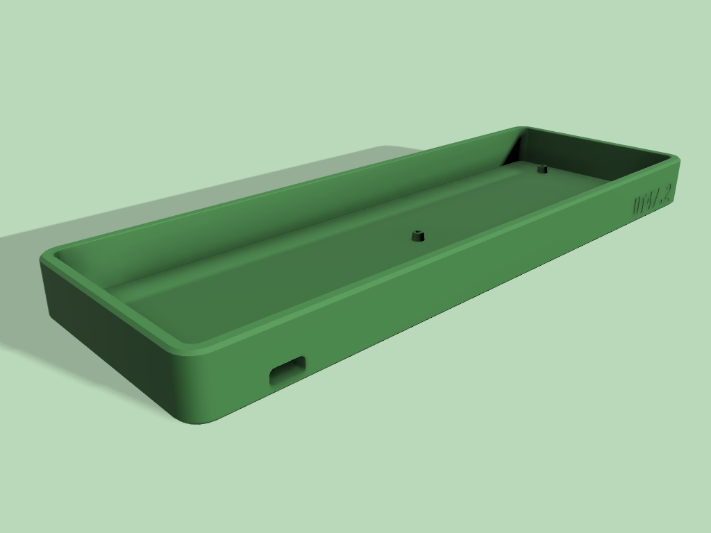
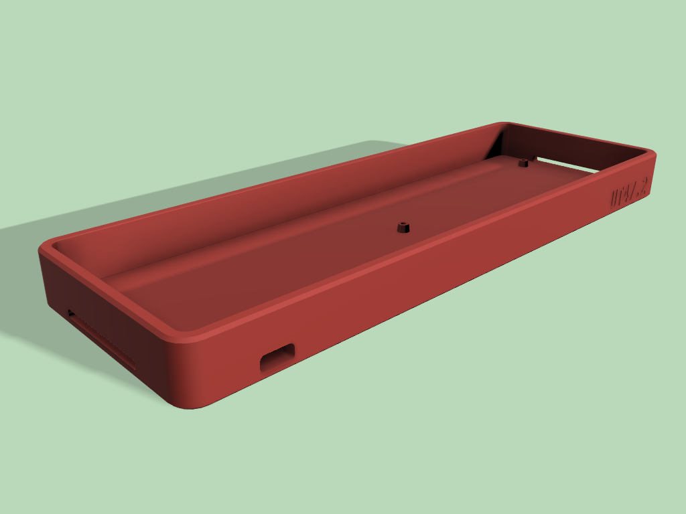
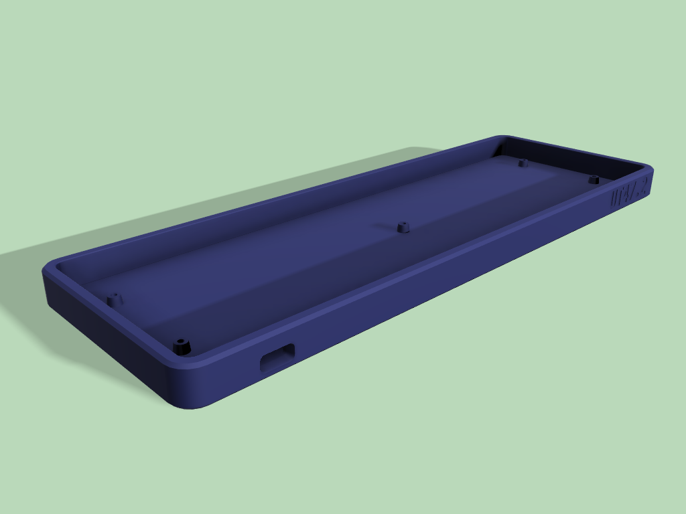

# UT47.2 TM (Tray Mount) Case

For 3D Printing usage only, not tested for CNC

## Version

### TM Case

This case has no open slots, highly recommended to use transparent/translucent 3D print material to let the underglow diffuses.

### TM Case RGB

This case has 2 open slots on the side to let the RGB underglow shine through.

### TM Case LP

Low Profile version, the top edge almost flush with the plate. This case has no open slots, highly recommended to use transparent/translucent 3D print material to let the underglow diffuses.

### TM Case LP RGB

Low Profile version, the top edge almost flush with the plate. This case has 2 open slots on the side to let the RGB underglow shine through.

## Additional hardwares

|    | Amount |
| --- | ---: |
| Original Plate from the kit |  |
| M2 heat set insert | 5 |
| M2x4 screws | 5 |
