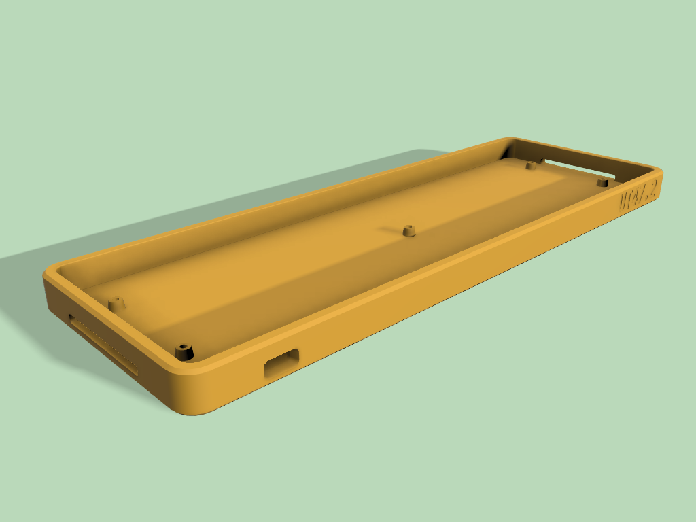

# UT47.2 TM (Tray Mount) Case

For 3D Printing usage only, not tested for CNC.

All cases need heat set insert, otherwise the mount holes size need to be reduced to accomodate only screws.

 

## Version

### TM Case

[UT472-TMCase.stl](UT472-TMCase.stl)

This case has no open slots, highly recommended to use transparent/translucent 3D print material to let the underglow diffuses.

### TM Case RGB

[UT472-TMCase-RGB.stl](UT472-TMCase-RGB.stl)

This case has 2 open slots on the side to let the RGB underglow shine through.

### TM Case LP

[UT472-TMCase-LP.stl](UT472-TMCase-LP.stl)

Low Profile version, the top edge almost flush with the plate. This case has no open slots, highly recommended to use transparent/translucent 3D print material to let the underglow diffuses.

### TM Case LP RGB

[UT472-TMCase-LP-RGB.stl](UT472-TMCase-LP-RGB.stl)

Low Profile version, the top edge almost flush with the plate. This case has 2 open slots on the side to let the RGB underglow shine through.

## Additional hardwares

|    | Amount | Link |
| --- | ---: | --- |
| Original Plate from the kit | | |
| M2 heat set insert | 5 | [Amazon](https://www.amazon.com/gp/product/B09333HP9L/) |
| M2x4 or M2x5 screws | 5 | [MonsterBolts](https://monsterbolts.com/collections/metric-phillips-pan-head-machine-screw/products/mach-phil-pan-blk-m2) |

## Notes

These cases are release with MIT License, so feel free to modify, extend or integrate them. As per license, there will be no warranty or liability related to these cases.

If you like these cases and find them useful, you can [buy me a coffee](https://www.buymeacoffee.com/coffeeforba).
